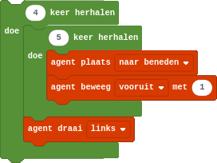

## Geneste herhalingen
Je kunt een lus in een andere lus stoppen. Hoewel dit een eenvoudig concept is, is dit vaak moeilijker om te bevatten.

Hopelijk herinner je je nog hoe we in Minecraft een vierkant konden laten bouwen:

{:data-caption="Een geneste herhaling in Minecraft Education Edition" width="272px"}

In Python programmeer je een geneste herhaling als volgt:

```python
for i in range( 4 ):
    for j in range( 5 ):
        print ( '(i,j) = (', i, ',', j, ')' )
    print( ) # dit print een lege lijn
```

{: .callout.callout-info}
> #### Tip
> Het helpt bij geneste herhalingen om voor een vaste 'uiterste' waarde eerst de 'binnenste' lus te bevatten. In het bovenstaande geval zou dat neerkomen op het onderzoeken van de 'binnenste' lus voor een vaste `i` (bvb `i = 1`).


## Opgave
Schrijf een programma dat alle paren (i,j) afdrukt, waarbij i en j de waardes 0 tot en met 3 kunnen aannemen, maar ze nooit dezelfde waarde mogen hebben.

#### Voorbeeld
De uitvoer zou eruit moeten zien als volgt:
```
(i,j) = ( 0 , 1 )
(i,j) = ( 0 , 2 )
(i,j) = ( 0 , 3 )
(i,j) = ( 1 , 0 )
(i,j) = ( 1 , 2 )
(i,j) = ( 1 , 3 )
(i,j) = ( 2 , 0 )
(i,j) = ( 2 , 1 )
(i,j) = ( 2 , 3 )
(i,j) = ( 3 , 0 )
(i,j) = ( 3 , 1 )
(i,j) = ( 3 , 2 )
```