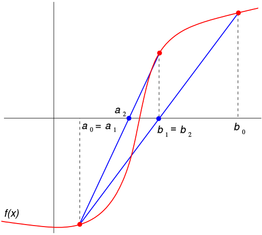

De methode van regula falsi is een iteratieve methode voor het bepalen van nulwaarden van continue functies op een interval waarbij de functiewaarden op de grenzen van dit interval een verschillend teken hebben.

Om bijvoorbeeld een nulwaarde van de functie $$f(x)$$ te bepalen op het interval $$[a,b]$$ gaat men als volgt te werk. In dit voorbeeld geldt $$f(a) <> 0$$ en $$f(b) >0$$.

- Men zoekt de $$x$$-coördinaat $$c$$ van het snijpunt met de $$x$$-as van de rechte door de punten $$(a,f(a) )$$ en $$(b, f(b))$$. 
- Bereken nadien $$f(c)$$. Is $$f(c)$$ strikt positief dan zoekt men verder op het interval $$[a,c]$$, indien $$f(c)$$ echter strikt negatief dan zoekt men verder op het interval $$[c,b]$$.
- Herhaal deze methode op het interval $$[a,c]$$ of $$[c,b]$$ afhankelijk van bovenstaande berekening.

Vaak zal de methode niet exact eindigen, maar is men tevreden indien voor een potentiële nulwaarde $$c$$ geldt dat $$f(c)$$ voldoende dicht van nul ligt. Men gebruikt hiervoor de breedte van het interval waartussen gezocht wordt.

{:data-caption="Afbeelding door Jitse Niesen op Wikimedia." width="375px"}

## Opgave

Schrijf een functie `regula_falsi( f, a, b, toleratie)` waarbij `f` een continue functie voorstelt met een nulwaarde van oneven orde, `a` en `b` respectievelijk de linker- en rechtergrenzen en `toleratie` de breedte van het interval waarop men zoekt. Hoe kleiner de toleratie, hoe nauwkeurig de methode.

De functie retourneert de nulwaarde tot op 4 cijfers na de komma nauwkeurig.

#### Voorbeelden
```
>>> def f( x ) : return x - 2
>>> bisectiemethode( f, 0, 5, 10**-4)
2.0
```

```
>>> def f( x ) : return x** 3 - 2
>>> bisectiemethode( f, 1, 4, 10**-5)
1.2599
```