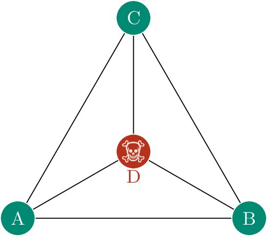

{:data-caption="Het probleem van de driehoekkruipers" width="33%"}

Beschouw de driehoek die hier is weergegeven. Deze driehoek bevat een kolonie Driehoekkruipers, en een Verslinder van Driehoekkruipers. De Verslinder zit in punt D. Alle Driehoekkruipers worden geboren in punt A. Een Driehoekkruiper die bij punt D aankomt, wordt opgegeten.

Iedere dag kruipt iedere Driehoekkruiper over een van de zijden in de driehoek naar een willekeurig bepaald punt, maar niet naar het punt waar hij de dag ervoor was. Deze beweging kost één dag.  
Bijvoorbeeld, een Driehoekkruiper die net geboren is in punt A, zal op de eerste dag van zijn leven kruipen naar B, C, of D. Als hij naar B gaat, zal hij de volgende dag naar C of D gaan, maar niet terug naar A. Als hij naar C gaat, zal hij de volgende dag naar B of D gaan, maar niet terug naar A. Als hij naar D gaat, wordt hij opgegeten.  

De waarschijnlijkheid dat een Driehoekkruiper op de eerste dag onmiddellijk naar D gaat is ⅓, en dan leeft hij dus maar één dag. In principe kan een Driehoekkruiper iedere willekeurige leeftijd bereiken, hoe hoog ook, door cylisch te bewegen van A naar B naar C en terug naar A (of tegen de klok in, van A naar C naar B en terug naar A).  
Maar omdat hij iedere dag na de eerste per toeval kiest voor een volgend punt, is iedere dag na de eerste de waarschijnlijkheid dat hij wordt opgegeten ½.  

## Opgave

Schrijf een programma dat een benadering berekent van de gemiddelde leeftijd waarop een Driehoekkruiper overlijdt. Doe dit door de simulatie van 100 000 Driehoekkruipers, waarbij je alle dagen dat ze leven optelt, en het totaal deelt door 100 000.  

De uitvoer van je programma moet gegeven zijn als **een kommagetal met twee decimalen**.

{: .callout.callout-info}
> #### Tips
> - Simuleer het gedrag van één Driehoekkruiper en herhaalt dat 100 000 keer.
> - Begin niet met 100 000 Driehoekkruipers voor je eerste pogingen. Start met 1000 (of misschien met slechts 1), en probeer het pas met 100 000 als je weet dat je programma min of meer klaar is. Testen gaat veel sneller met minder Driehoekkruipers. 1000 Driehoekkruipers kunnen worden gesimuleerd in minder dan een seconde, dus als je programma meer tijd nodig heeft, heb je waarschijnlijk een eindeloze loop gemaakt.
> - Het antwoord is ergens tussen de 1 en 5 dagen. Als je iets buiten dat bereik krijgt, is het zeker fout.

