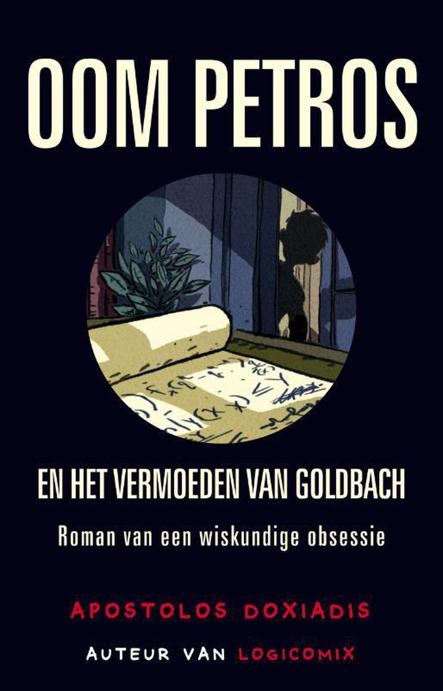

Het <a href="https://nl.wikipedia.org/wiki/Vermoeden_van_Goldbach" target="_blank">vermoeden van Goldbach</a> is een van de oudste onopgeloste problemen in de getaltheorie en in de gehele wiskunde. Het vermoeden werd geuit in een brief die Christian Goldbach aan Leonhard Euler in 1752 schreef. Het vermoeden luidt:

{: .callout.callout-primary}
> #### Vermoeden van Goldbach
> Elk even getal groter dan 2 kan geschreven worden als de som van twee, niet noodzakelijk verschillende, priemgetallen.

## Opgave
Schrijf een functie `goldbach( getal )` dat gegeven een getal controleert of dit getal geschreven kan worden als een som van 2 priemgetallen. 

Soms zijn er meerdere oplossingen, zo geldt bijvoorbeeld dat 10 = 3 + 7 maar ook 10 = 5 + 5. Neem dan de optie waarbij de eerste term zo klein mogelijk is.

{: .callout.callout-info}
> #### Tip
> Schrijf een functie `is_priem( getal )` dat controleert of een getal priem is.

#### Leestip
*Oom Petros en het vermoeden van Goldbach* van *Apostolis Doxiadis*; een aansprekende roman over een oom die het zwarte schaap van de familie is, omdat hij zijn leven heeft verkwanseld in een poging het vermoeden van Goldbach te bewijzen. Een verhaal waaruit duidelijk blijkt hoe fascinerend, maar ook hoe frustrerend een onopgelost probleem kan zijn!
{:data-caption="Oom Petros en het vermoeden van Goldbach." width="30%"}

#### Voorbeelden
```
>>> goldbach( 8 )
8 = 3 + 5
```

```
>>> goldbach( 10 )
8 = 3 + 7
```

```
>>> goldbach( 7 )
Het vermoeden is hier niet van toepassing.
```