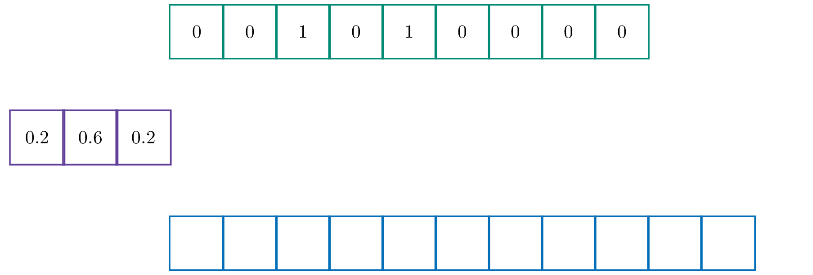

Convolutieproducten vormen een belangrijke bewerking in binnen de signaal- en beeldverwerking. In het onderstaande voorbeeld wordt het eendimensionale geval uiteengedaan. Hetzelfde proces is mogelijk voor twee of meer dimensies (zoals bij beeldverwerking). Ook binnen neurale netwerken vormen convoluties een essentiele bouwsteen.

Omdat de wiskundige definitie vrij ingewikkeld is, wordt er meteen met een voorbeeld gewerkt.

Voor een eendimensionale (discrete) convolutie heb je **twee lijsten** nodig. Een *bronlijst* en een lijst genaamd de *kernel*. Stel bijvoorbeeld dat de bronlijst de lijst `[0, 0, 1, 0, 1, 0, 0, 0, 0]]` en de kernel `[0.2, 0.6, 0.4]` is.

{:data-caption="Animatie door D. Vanderfaeillie." width="60%"}

## Opgave
Schrijf een functie `convolutie()` die gegeven twee lijsten het convolutieproduct uitrekent. Zorg ervoor dat de getallen in de resulterende lijst **afgerond** worden op één cijfer na de komma.


#### Voorbeelden
```
>>> convolutie( [0, 0, 1, 0, 1, 0, 0, 0, 0] , [0.2, 0.6, 0.4] )
[[0.0, 0.0, 0.4, 0.6, 0.6, 0.6, 0.2, 0.0, 0.0, 0.0, 0.0]
```