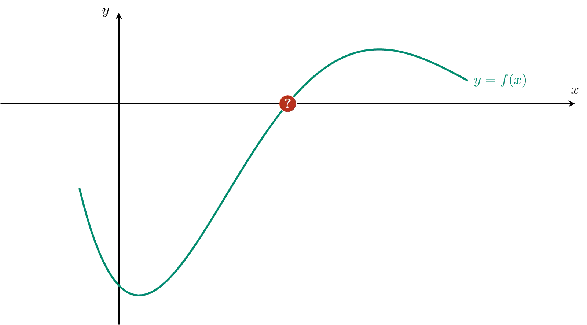
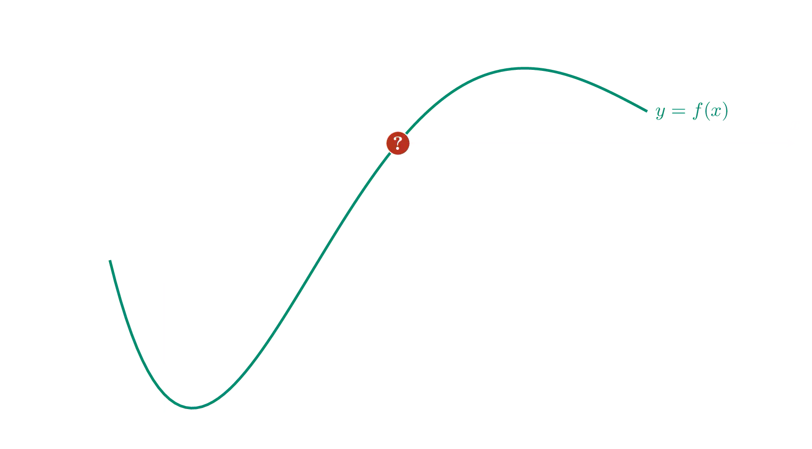

Er bestaat een aangepaste versie van de methode van regula falsi. Deze methode is meestal sneller dan de bisectiemethode en de gewone methode van regula falsi. (Maar niet altijd...)

Om bijvoorbeeld een nulwaarde van de functie $$f(x)$$ te bepalen op het interval $$[a,b]$$ gaat men als volgt te werk. In dit voorbeeld geldt $$f(a) < 0$$ en $$f(b) > 0$$.

- Men zoekt de $$x$$-coördinaat $$c$$ van het snijpunt met de $$x$$-as van de rechte door de punten $$(a,y_a)$$ en $$(b, y_b)$$ met $$y_a = f(a)$$ en $$y_b = f(b)$$. 
- Bereken nadien $$f(c)$$. Is $$f(c)$$ strikt positief dan zoekt men verder op het interval $$[a,c]$$, indien $$f(c)$$ echter strikt negatief dan zoekt men verder op het interval $$[c,b]$$.
- **Nieuw** is nu dat ook de $$y$$-coördinaat wordt aangepast. Indien $$f(c)$$ strikt positief is, dan wordt $$y_a = \dfrac{f(a)}{2}$$. Indien $$f(c)$$ echter strikt negatief dan wordt $$y_b = \dfrac{f(b)}{2}$$
- Herhaal deze methode op het interval $$[a,c]$$ of $$[c,b]$$ afhankelijk van bovenstaande berekening.

Vaak zal de methode niet exact eindigen, maar is men tevreden indien voor een potentiële nulwaarde $$c$$ geldt dat $$f(c)$$ voldoende dicht van nul ligt. Gebruik hiervoor de absolute waarde van $$f(c)$$. Het programma eindigt dus indien $$\lvert f(c)\rvert \leqslant \delta$$ met $$\delta$$ een bepaalde toleratie.

{:data-caption="Animatie door D. Vanderfaeillie." .light-only width="60%"}

{:data-caption="Animatie door D. Vanderfaeillie." .dark-only width="60%"}

## Opgave

Schrijf een functie `regula_falsi_modified( f, a, b, toleratie)` waarbij `f` een continue functie voorstelt met een nulwaarde van oneven orde, `a` en `b` respectievelijk de linker- en rechtergrenzen en `toleratie` de breedte van het interval waarop men zoekt. Hoe kleiner de toleratie, hoe nauwkeurig de methode.

De functie retourneert de nulwaarde tot op 4 cijfers na de komma nauwkeurig.

#### Voorbeelden
```
>>> def f( x ) : return x - 2
>>> regula_falsi_modified( f, 0, 5, 10**-4)
2.0
```

```
>>> def f( x ) : return x** 3 - 2
>>> regula_falsi_modified( f, 1, 4, 10**-5)
1.2599
```