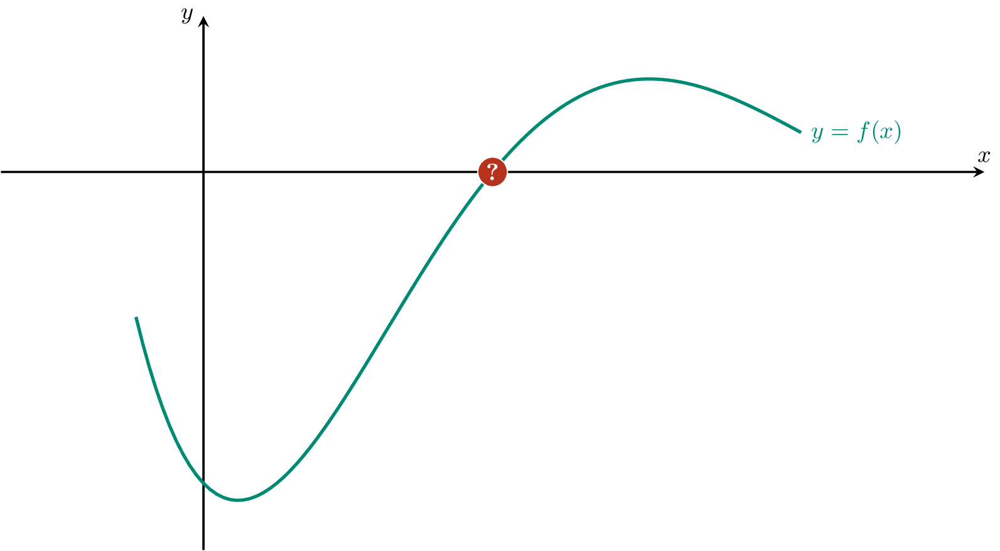

De koordenmethode of secant-methode is een methode voor het bepalen van nulwaarden van een functie. Het is een numerieke methode die al zeer lang gekend is.

De methode lijkt op het eerste zicht op regula falsi, maar er is een belangrijke wijziging. In deze methode gebruikt men steeds het vorige snijpunt met de $$x$$-as. 

- Men krijgt twee vertrekwaarden $$x_1$$ en $$x_2$$. Men bepaalt het snijpunt van de rechte door $$(x_1, f(x_1))$$ en $$(x_2, f(x_2))$$ met de $$x$$-as en noemt dit $$x_3$$.
- Vervolgens bepaalt met het snijpunt van de rechte door $$(x_2, f(x_2))$$ en $$(x_3, f(x_3))$$ met de $$x$$-as en noemt dit $$x_4$$.
- enz...

Bij slechte keuzes voor $$x_1$$ en $$x_2$$ (of bij moeilijke functies) kan het zijn dat deze methode **nooit** tot een oplossing leidt. Met andere woorden, dat de waarden voor $$x_i$$ **niet convergeren** maar **divergeren**. Indien de waarden wel naar een nulwaarde convergeren dan is men tevreden indien voor een potentiële nulwaarde $$x_i$$ geldt dat $$f(x_i)$$ voldoende dicht van nul ligt. Gebruik hiervoor de absolute waarde van $$f(x_i)$$. Het programma eindigt dus indien $$\lvert f(x_i)\rvert \leqslant \delta$$ met $$\delta$$ een bepaalde toleratie.

{:data-caption="Animatie door D. Vanderfaeillie." width="60%"}

## Opgave

Schrijf een functie `koordenmethode( f, x1, x2, toleratie )` waarbij `f` een continue functie voorstelt met een nulwaarde, `x1` en `x2` als startwaarden en `toleratie` de nauwkeurigheid die men instelt. Hoe kleiner de toleratie, hoe nauwkeurig de methode.

De functie retourneert de nulwaarde tot op 4 cijfers na de komma nauwkeurig.

{: .callout.callout-info}
> #### Tip
> Om o*neindige lussen* te vermijden zal men de iteratie stoppen voor 100 stappen.

#### Voorbeelden
```
>>> def f( x ) : return x - 2
>>> koordenmethode( f, 0, 5, 10**-4 )
2.0
```

```
>>> def f( x ) : return x** 3 - 2
>>> koordenmethode( f, 1, 4, 10**-5)
1.2599
```