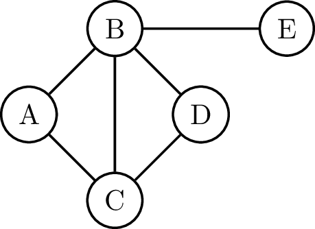
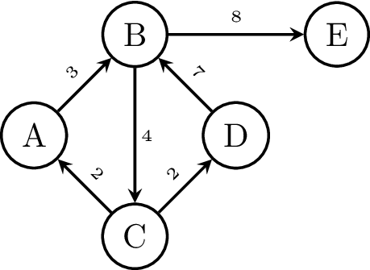

**Grafen** zijn wiskundige structuren die bestaan uit een verzameling van **knopen** of toppen, meestal aangeduid met de letter $$V$$ (van vertices) en een verzameling van *bogen*, meestal aangeduid met de letter $$E$$ (van edges).

Deze structuren zijn heel belangrijk binnen de wiskunde en de informaticawetenschappen, maar komen ook voor binnen de chemie of zelfs taalkunde.

Hieronder zie je een voorbeeld van een graaf.

{:data-caption="Afbeelding van een ongerichte graaf." .light-only width="30%"}
{:data-caption="Afbeelding van een ongerichte graaf." .dark-only width="30%"}


Deze graaf heeft 5 knopen en 6 bogen. Deze kan je binnen Python bijvoorbeeld voorstellen via twee lijsten, een lijst met de knopen en een lijst die opgebouwd is uit tupels met de bogen.

```python
V = ['A', 'B', 'C', 'D', 'E']
E = [('A', 'B'), ('C', 'A'), ('B','C'), ('C', 'D'), ('D', 'B'), ('B', 'E')]
```

Het vorige voorbeeld stelde een **ongerichte** graaf voor. De boog tussen $$A$$ en $$B$$ is dezelfde als de boog tussen $$B$$ en $$A$$. Er bestaan ook **gerichte** grafen. Hierbij krijgt elke boog een richting.

{:data-caption="Afbeelding van een gerichte graaf." width="30%"}

Het bovenstaande voorbeeld stelt zelfs een **gewogen** graaf voor. Elke verbinding krijgt een bepaald gewicht. Denk aan een kost tussen twee punten, bijvoorbeeld de tijd om van punt $$A$$ naar punt $$B$$ te gaan is 3 min.

De voorstelling binnen Python wordt analoog:

```python
V = ['A', 'B', 'C', 'D', 'E']
E = [('A', 'B', 3), ('B','C', 4), ('C', 'A', 2), ('C', 'D', 2), ('D', 'B', 7), ('B', 'E', 8)]
```

Volgens afspraak is deze graaf dan gericht, de volgorde van de knopen in de tupels is dus van belang.

## Opgave

De graad van een knoop wordt als volgt gedefinieerd:

{: .callout.callout-primary}
> #### Graad van een knoop
> De **graad** van een knoop in een *ongerichte* graaf is het aantal buren van die knoop. 

In het voorbeeld van de ongerichte graaf merken we dus op dat de graad van $$B$$ 4 is. Terwijl de graad van $$E$$ slechts 1 is.

Schrijf een functie `graad( knoop, E )` die de graad bepaalt van een *ongerichte* graaf, waarbij `knoop` de knoop voorstelt die men wil onderzoeken en `E` een lijst opgesteld uit tupels van bogen.

#### Voorbeelden
```
>>> graad( 'B', [('A', 'B'), ('C', 'A'), ('B', 'C'), ('C', 'D'), ('B', 'D'), ('B', 'E')] )
4
```

```
>>> graad( 'E', [('A', 'B'),  ('C', 'A'), ('B', 'C'), ('C', 'D'), ('B', 'D'), ('B', 'E')] )
1
```

```
>>> graad( 'C', [('A', 'E'), ('C', 'D'), ('C', 'A'), ('D', 'E'), ('A', 'D'), ('C', 'E'), ('E', 'B')] )
3
```