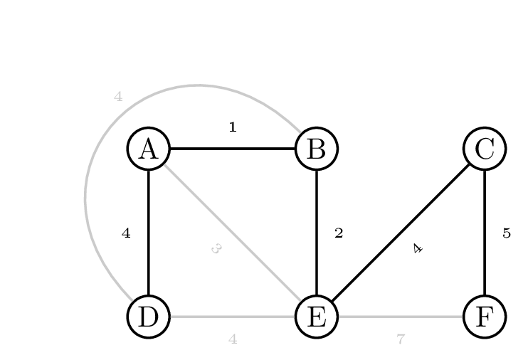
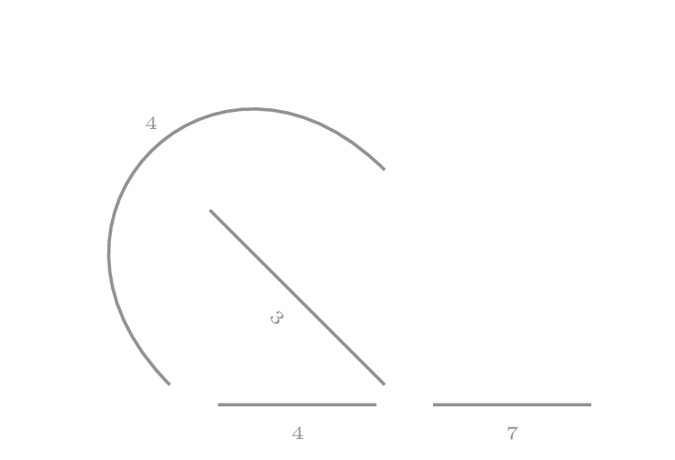

Een <a href="https://nl.wikipedia.org/wiki/Minimaal_opspannende_boom" target="_blank">minimaal opspannende boom</a> (minimal spanning tree **MST**), is een graaf waarbij alle knopen met elkaar verbonden zijn, met een **minimaal gewicht**.

{:data-caption="Een minimaal opspannende boom binnen een graaf." .light-only width="40%"}

{:data-caption="Een minimaal opspannende boom binnen een graaf." .dark-only width="40%"}

Hier zie je een voorbeeld van een **minimaal opspannende boom** binnen een graaf. Het is mogelijk om van elke knoop naar elke andere knoop te wandelen en hierbij is de totale som van de bogen minimaal.

Er zijn verschillende manieren om gegeven een graaf een minimaal opspannende boom op te stellen. Eén van de mogelijkheden is <a href="https://nl.wikipedia.org/wiki/Algoritme_van_Prim" target="_blank">het algoritme van van **Prim**</a>. In 1930 door de Tsjechische wiskundige Vojtěch Jarník ontdekt, daarna verloren gegaan en later herontdekt door de informaticus Robert C. Prim.

Het algoritme werkt door de minimaal opspannende boom (*MST*) **stapsgewijs op te bouwen**.

- Kies een willekeurige startknoop $$v_1$$.
- Analyseer alle bogen die verbonden zijn met $$v_1$$ en voeg de boog met minimaal gewicht toe aan de *MST*.
- De minimaal opspannende boom bestaat nu uit één enkele boog.
    - Beschouw nu alle toppen die verbonden kunnen worden met de huidige *MST* en de bijbehorende bogen.
    - Voeg opnieuw de boog met minimaal gewicht toe aan de *MST*.
- Herhaal dit proces tot het aantal bogen in de *MST* gelijk is aan $$n-1$$, met $$n$$ het aantal toppen.

{:data-caption="Het algoritme van Prim in werking." .light-only width="30%"}

{:data-caption="Het algoritme van Prim in werking." .dark-only width="30%"}


## Opgave

Schrijf een functie `MST_prim( V, E )` waarbij `V` een lijst met toppen voorstelt en `E` een lijst opgesteld uit tupels van bogen met hun gewicht. 
Kies als **startwaarde** steeds **de eerste knoop** die voorkomt in `V`. Met andere woorden, stel `v1 = V[0]`.

#### Voorbeelden
```
>>> MST_prim( ['A', 'B', 'C', 'D', 'E'], 
              [('A', 'B', 3), ('B', 'C', 4),('C', 'D', 2),('B', 'D', 7),('B', 'E', 8)] )
[('A', 'B', 3), ('B', 'C', 4), ('C', 'D', 2), ('B', 'E', 8)]
```

```
>>> MST_prim( ['A', 'B', 'C', 'D', 'E', 'F', 'G'],
              [('A','D',5), ('A', 'B', 7), ('B','D',9), ('B','C',8), ('C','E',5), ('B','E',7), 
               ('D','E',15), ('D','F',6), ('F', 'E', 8), ('E', 'G',9), ('F','G',11)] ) 
[('A', 'D', 5), ('D', 'F', 6), ('A', 'B', 7), ('B', 'E', 7), ('C', 'E', 5), ('E', 'G', 9)]
```