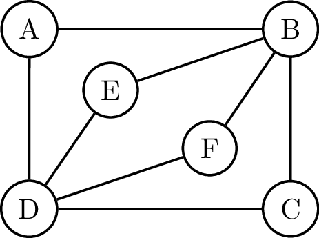

{: .callout.callout-primary}
> #### Euler-pad
> Een pad in een graaf waarin **alle ribben** precies  één keer voorkomen, heet een Euler-pad.


{:data-caption="Een Euler cykel op een Eulerse graaf." width="30%"}


{: .callout.callout-primary}
> #### Stelling
> In een graaf met een **Euler cykel** hebben alle knopen een **even graad**, men noemt dit een Eulerse graaf.

## Opgave

Schrijf een programma dat controleert of een gegeven graaf een Eulerse graaf is. 

#### Voorbeelden
```
>>> euler_graaf( [('A', 'B'), ('C', 'A'), ('B', 'C'), ('C', 'D'), ('B', 'D'), ('B', 'E')] )
False
```