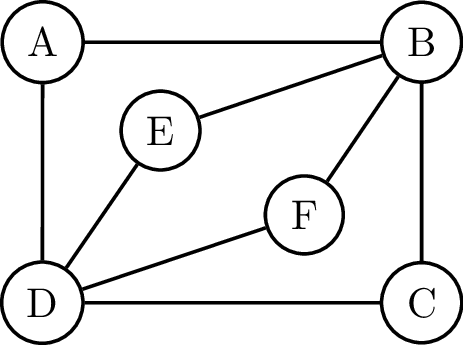

In de achttiende eeuw had de Russische stad Koningsbergen (vanaf 1946 omgedoopt tot Kaliningrad) gelegen aan de monding van de Pregel, zeven bruggen. Er was <a href="https://nl.wikipedia.org/wiki/Zeven_bruggen_van_Koningsbergen" target="_blank">een klassiek probleem</a> verbonden aan deze bruggen, namelijk: "Is het mogelijk om een wandeling door Koningsbergen te maken, precies één keer over elke brug te lopen en op het beginpunt te eindigen?"

Het was wiskundig genie <a href="https://nl.wikipedia.org/wiki/Leonhard_Euler" target="_blank">Leonard Euler</a> die in 1736 dit probleem oploste.

{:data-caption="Je nieuwe held, Leonhard Euler" width="30%"}

Hij bewees namelijk dat dit pas mogelijk was indien de graad van alle knopen in de bijbehorende graaf even was. Het pad of de wandeling die hierbij hoort noemt men dan ook een **Eulerpad**. Een graaf waar zo'n Eulerpad bestaat noemt men een **Eulergraaf**.

{: .callout.callout-primary}
> #### Eulerpad
> Een pad of wandeling in een graaf waarin **alle ribben** precies  één keer voorkomen, heet een Eulerpad.

Hier zie je een Eulerpad gedemonstreerd op een Eulergraaf.

{:data-caption="Een Euler cykel op een Eulergraaf." .light-only width="30%"}

{:data-caption="Een Euler cykel op een Eulergraaf." .dark-only width="30%"}

Later werd bewezen dat de vondst van Euler ook voldoende is om te besluiten dat een graaf Eulers is.

{: .callout.callout-primary}
> #### Stelling van Hierholzer (1873)
> Als de graden van **alle knooppunten** van een *(samenhangende)* graaf *(met meer dan 2 knopen)* even zijn, dan is deze graaf een eulergraaf.

## Opgave

Schrijf een functie `euler_graaf( V, E )` gegeven een lijst met knopen `V` en een lijst met tupels van bogen `E`, dat controleert of een gegeven graaf een eulergraaf is. 

#### Voorbeelden
```
>>> euler_graaf( ['A', 'B', 'C', 'D', 'E', 'F'],
                 [('A', 'B'), ('B', 'C'), ('C', 'D'), ('D', 'A'), ('B','E'), ('E', 'D'), ('D','F'), ('F', 'B')] )
True
```

```
>>> euler_graaf( ['A', 'B', 'C', 'D', 'E', 'F'] , 
                 [('A', 'C'), ('B', 'F'), ('C', 'B'), ('D', 'F'), ('E', 'C'), ('C', 'F'), ('C', 'D')] )
False
```