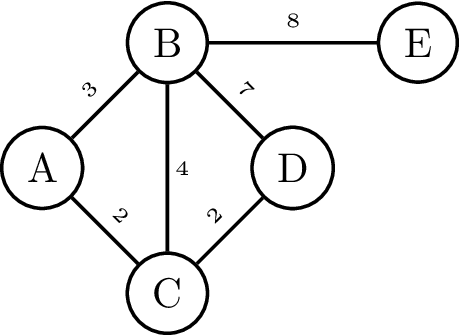

{:data-caption="Afbeelding van een gewogen graaf." width="30%"}

Het bovenstaande voorbeeld stelt een **gewogen** graaf voor. Elke verbinding krijgt een bepaald gewicht. Denk aan een kost tussen twee punten, bijvoorbeeld de tijd om van punt $$A$$ naar punt $$B$$ te gaan is 3 min.

De voorstelling binnen Python is:

```python
V = ['A', 'B', 'C', 'D', 'E']
E = [('A', 'B', 3), ('B','C', 4), ('C', 'A', 2), ('C', 'D', 2), ('D', 'B', 7), ('B', 'E', 8)]
```

## Opgave

Schrijf een functie `gewicht( E )` die gegeven een lijst met gewogen bogen, het totale gewicht berekent.

#### Voorbeeld
```
>>> gewicht( [('A', 'B', 3), ('B','C', 4), ('C', 'A', 2), ('C', 'D', 2), ('D', 'B', 7), ('B', 'E', 8)] )
26
```
