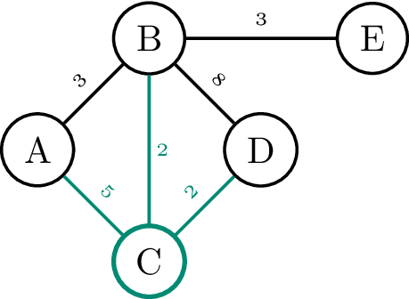

## Opgave

Schrijf een functie `verbonden_bogen( v, E )` die gegeven een knoop `v` en een **lijst** `E` met (gewogen) bogen alle bogen bepaalt die met `v` verbonden zijn.

#### Voorbeeld

{:data-caption="De bogen verbonden met C in een gewogen graaf." width="30%"}

```
>>> verbonden_bogen( 'C', [('A', 'B', 3), ('B', 'C', 2), ('C', 'A', 5), ('C', 'D', 2), ('D', 'B', 8), ('B', 'E', 3)] )
[('B', 'C', 2), ('C', 'A', 5), ('C', 'D', 2)]
```
