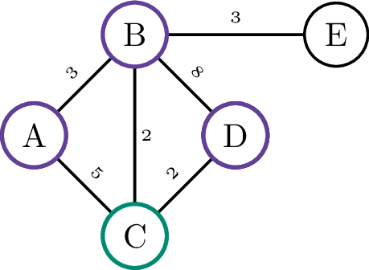
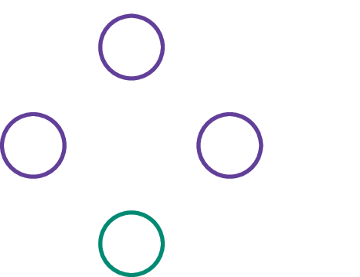

## Opgave

Schrijf een functie `verbonden_knopen( v, E )` die gegeven een knoop `v` en een **lijst** `E` met (gewogen) bogen alle knopen bepaalt die met `v` verbonden zijn.

Sorteer de lijst alfabetisch. Sorteer daarvoor eerst de lijst via `lijst.sort()`, waarna je kan gebruik maken van `return lijst`.

#### Voorbeeld

{:data-caption="De knopen verbonden met C in een gewogen graaf." .light-only width="30%"}

{:data-caption="De knopen verbonden met C in een gewogen graaf." .dark-only width="30%"}

```
>>> verbonden_knopen( 'C', [('A', 'B', 3), ('B', 'C', 2), ('C', 'A', 5), ('C', 'D', 2), ('D', 'B', 8), ('B', 'E', 3)] )
['A', 'B', 'D']
```
