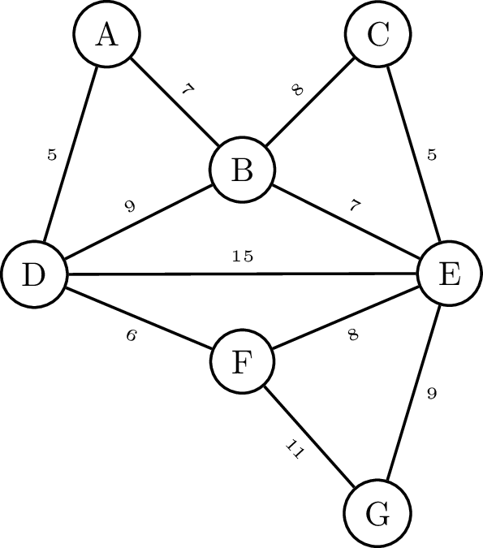

## DO NOT USE ##

Een ander algoritme om een minimaal opspannende boom (*MST*) te bepalen, is <a href="https://nl.wikipedia.org/wiki/Kruskals_algoritme">het algoritme van **Kruskal**</a>. Gevonden in 1956 door de Amerikaan wiskundige Joseph Kruskal. 

Het algoritme werkt door de minimaal opspannende boom (*MST*) **stapsgewijs op te bouwen**.

- Kies de boog met het minimale gewicht die **geen cykel** vormt met de bogen die reeds werden gekozen.
- Herhaal dit proces tot het aantal bogen in de *MST* gelijk is aan $$n-1$$, met $$n$$ het aantal toppen.

{:data-caption="Het algoritme van Kruskal in werking." width="30%"}

## Opgave

Schrijf een functie `MST_kruskal( V, E )` waarbij `V` een lijst met toppen voorstelt en `E` een lijst opgesteld uit tupels van bogen met hun gewicht. 

#### Voorbeelden
```
>>> MST_kruskal( ['A', 'B', 'C', 'D', 'E'], 
              [('A', 'B', 3), ('B', 'C', 4),('C', 'D', 2),('B', 'D', 7),('B', 'E', 8)] )
[('A', 'B', 3), ('B', 'C', 4), ('C', 'D', 2), ('B', 'E', 8)]
```

```
>>> MST_kruskal( ['A', 'B', 'C', 'D', 'E', 'F', 'G'],
              [('A','D',5), ('A', 'B', 7), ('B','D',9), ('B','C',8), ('C','E',5), ('B','E',7), 
               ('D','E',15), ('D','F',6), ('F', 'E', 8), ('E', 'G',9), ('F','G',11)] ) 
[('A', 'D', 5), ('D', 'F', 6), ('A', 'B', 7), ('B', 'E', 7), ('C', 'E', 5), ('E', 'G', 9)]
```