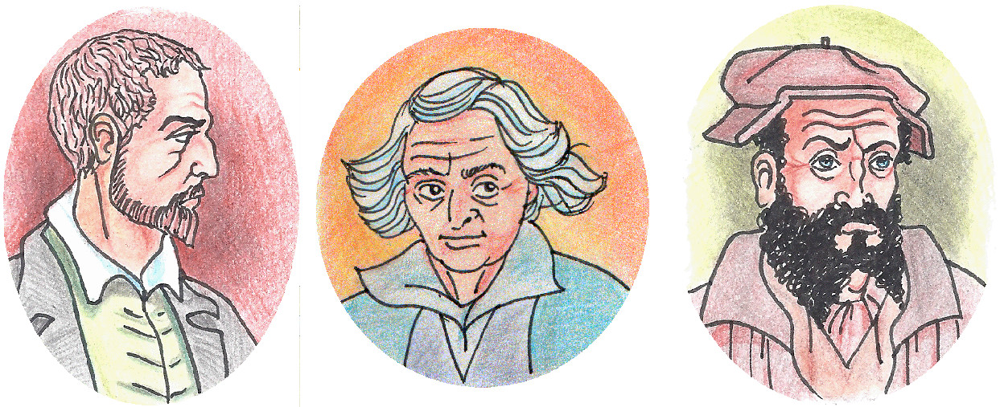

Na het bepalen van een algemene methode voor het oplossen van vierkantsvergelijkingen werd gezocht naar de algemene oplossing van een derdegraadsvergelijling. Dit is een vergelijking van de gedaante:
$$ax^3+bx^2+cx+d=0$$

In 1545 onstond in Italie een ware rel toen de wiskundige Gerolamo Cardano een algemene oplossing publiceerde voor een gereduceerde derdegraadsvergelijking. Dit is een vergelijking van de gedaante:
$$x^3+px+q=0$$

{:data-caption="De wiskundigen Gerolamo Cardano, Scipione del Ferro en Niccolo Fontana Tartaglia." width="300px"}

Oorzaak van de rel was dat een andere wiskundige Niccolò Fontana Tartaglia in 1539 zijn oplossingsmethode deelde met Cardano, maar onder de belofte dat hij dit nooit zou publiceren. Ondertussen had Cardano een analoge oplossingsmethode besproken met een derde wiskundige, namelijk Scipione del Ferro. Het volledige dispuut ging gepaard met heel wat beledigingen.

## Opgave

Net als bij een vierkantsvergelijking speelt een getal D, genaamd de discriminant, hier opnieuw een bepalende rol. Voor de gereduceerde derdegraadsvergelijking is deze discriminant van de vorm:
$$ D = -4p^3 -27q^2$$

Een derdegraadsvergelijking zal in het meest algemene geval, namelijk indien de discriminant strikt positief is, 3 verschillende reële oplossingen hebben. Is de discriminant echter gelijk aan nul dan zullen mintens 2 oplossingen aan elkaar gelijk zijn. En bij een strikt negatieve discriminant is altijd slechts één reële oplossing

Schrijf een functie `discriminant( p, q )` die voor een gereduceerde derdegraadsvergelijking $$x^3+px+q=0$$ het aantal oplossingen op het scherm afdrukt. 

#### Voorbeelden
De vierkantsvergelijking $$x^2+3x-4 = 0$$ heeft als oplossingenverzameling $$V = \{-4, 1\}$$.
```
>>> vkv( 1, 3, -4 ) 
Er zijn 2 reële oplossingen, namelijk 1.0 en -4.0
```

De vierkantsvergelijking $$x^2+x+1 = 0$$ heeft als oplossingenverzameling $$V = \{-1\}$$.
```
>>> vkv( 1, 2, 1 ) 
Er is één oplossing, namelijk: -1.0
```

De vierkantsvergelijking $$2x^2+6x+5 = 0$$ heeft geen reële oplossingen.
```
>>> vkv( 2, 6, 5 ) 
Er zijn geen reële oplossingen
```