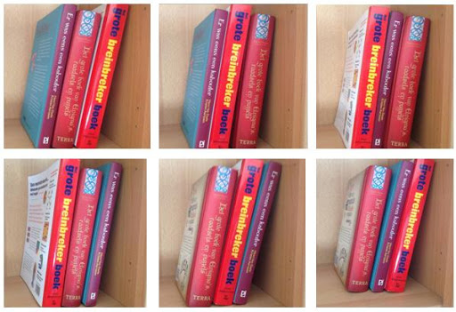

De faculteit van een natuurlijk getal $$n$$, genoteerd als $$n!$$ (uitgesproken als: $$n$$ faculteit), is het product van de getallen 1 tot en met $$n$$, met andere woorden:

$$
n! = 1\cdot 2\cdot 3\cdot \ldots \cdot n
$$

Bijvoorbeeld: $$4! = 1\cdot 2\cdot 3\cdot 4 = 24$$. Een belangrijke toepassing van de faculteit is het kunnen uitrekenen van telproblemen. Bijvoorbeeld: op hoeveel manieren kan je 3 verschillende objecten rangschikken/ordenen? Het antwoord blijkt gelijk te zijn aan $$3! = 1\cdot 2\cdot 3 = 6$$. Dit zie je ook in de afbeelding hieronder: er zijn 6 mogelijke manieren om 3 boeken te ordenen. 

{:data-caption="Het aantal manieren om een 3 boeken te ordenen is 3 faculteit." width="35%"}

## Opgave
Schrijf een functie `faculteit()` met een natuurlijk getal als parameter dat de faculteit van het getal **retourneert**.

#### Voorbeeld
```
>>> faculteit( 4 )
24
>>> faculteit( 6 )
720
```