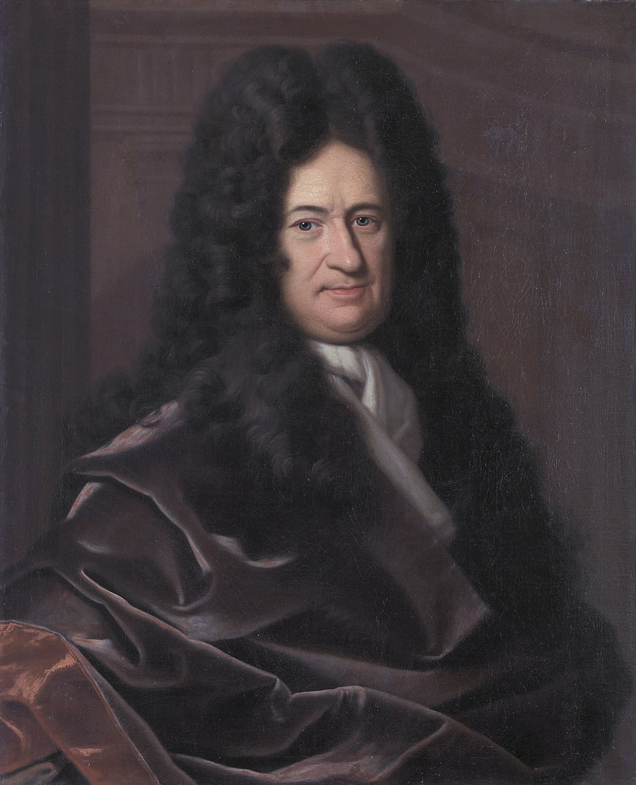

In 1673 bewees <a href='https://nl.wikipedia.org/wiki/Gottfried_Wilhelm_Leibniz' target='_blanc'>Gottfried Leibniz</a> onderstaande formule om het getal π te kunnen berekenen (in de praktijk: *benaderen*).

{:data-caption="Gottfried Wilhelm Leibniz, aartsrivaal van Sir Isaac Newton." width="20%"}

$$
\dfrac{\pi}{4} = 1 - \dfrac{1}{3}+\dfrac{1}{5} -\dfrac{1}{7}+\dfrac{1}{9}-\ldots
$$

Door zowel het linker- als rechterlid te vermenigvuldigen met 4 vinden we een benadering voor π.

$$
\pi = 4 \cdot \left( 1 - \dfrac{1}{3}+\dfrac{1}{5} -\dfrac{1}{7}+\dfrac{1}{9}-\ldots \right)
$$

## Opgave

Bepaal een benadering voor het getal π met bovenstaande uitdrukking. Vul hiervoor onderstaande functie `leibniz_benadering()` aan. De parameter stelt het aantal termen in de som voor. Rond de benadering steeds af op 9 cijfers na de komma.

#### Voorbeelden
Zoals je in onderstaande voorbeelden merkt moeten er vrij veel termen berekend opdat de benadering in de buurt komt, gelukkig kan een computer dit vrij vlot.
```
>>> leibniz_benadering( 10 )
3.049361636
```
```
>>> leibniz_benadering( 100 )
3.132076532
```
```
>>> leibniz_benadering( 10000 )
3.141497164
```