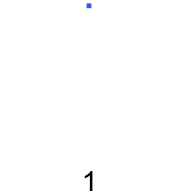

Een vijfhoeksgetal is een getal, dat het aantal punten is van **gezamenlijke** regelmatige vijfhoeken met een gemeenschappelijk eerste hoekpunt en twee gedeeltelijk gemeenschappelijke zijden, en met een telkens oplopend aantal punten per zijde. 

De rij van vijfhoeksgetallen begint als volgt:

$$
    1,\qquad 5,\qquad 12,\qquad 22,\qquad 35,\qquad 51, \ldots
$$

{:data-caption="De eerste zes vijfhoeksgetallen." width="30%"}

## Opgave
Schrijf een functie `vijfhoeksgetal()` met een natuurlijk getal als parameter die alle vijfhoeksgetallen kleiner dat dat getal afdrukt.

#### Voorbeeld
```
>>> vijfhoeksgetal( 50 )
1 : 1
2 : 5
3 : 12
4 : 22
5 : 35
```