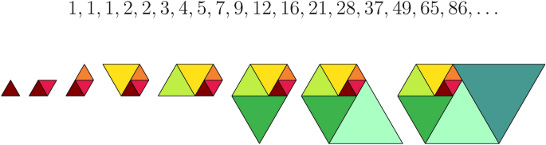

De rij van Padovan is een rij natuurlijke getallen die gedefinieerd wordt met als eerste drie getallen telkens 1.

Daarna worden de getallen gevormd door het 2e laatste getal en het 3e laatste getal op te tellen. Men krijgt dus als rij:

$$
1 \quad 1 \quad 1 \quad 2 \quad 2 \quad 3 \quad 4 \quad 5 \quad 7 \quad 9 \quad \ldots
$$

{:data-caption="De rij van Padovan kan men voorstellen met behulp van gelijkzijdige driehoeken." width="45%"}

## Opgave
Schrijf een functie `padovan()` met het rangnummer als parameter en zodat deze het getal met dat rangnummer afdrukt.

#### Voorbeelden
```
>>> padovan( 3 )
1
```
```
>>> padovan( 10 )
9
```
```
>>> padovan( 50 )
696081
```

{: .callout.callout-info}
> #### Tip
> Maak gebruik van de selectie `if` om de eerste 3 rangnummers apart op te vangen.