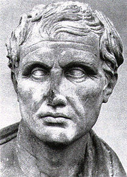

```
Arma virumque cano, Troiae qui primus ab oris
Italiam, fato profugus, Laviniaque venit
litora, multum ille et terris iactatus et alto
vi superum saevae memorem Iunonis ob iram;
multa quoque et bello passus, dum conderet urbem,
inferretque deos Latio, genus unde Latinum,
Albanique patres, atque altae moenia Romae.

Musa, mihi causas memora, quo numine laeso,
quidve dolens, regina deum tot volvere casus
insignem pietate virum, tot adire labores
impulerit. Tantaene animis caelestibus irae?
```

Ofwel, in het Nederlands 'testje':

```
Ik bezing de wapenfeiten en de man, 
die - op de vlucht voor het lot - als eerste
van de kusten van Troje naar Italië kwam,
naar de kusten van Lavinium. 
Hij die veel rondgezworven heeft, zowel op land als op zee,
door de kracht van de woeste hemelgoden en de niet aflatende woede van Juno.
Hij heeft ook veel oorlogen doorstaan,
totdat hij zijn stad stichtte en de goden naar Latium bracht,
vanwaar het Latijnse volk, de voorvaderen van de Alba Longa,
en de stadsmuren van het hoge Rome zijn ontstaan.

Muze, vertel mij welke goddelijke macht er geschonden werd,
welk leed de koningin van de goden ertoe bracht een man,
zo plichtsgetrouw, zoveel ellende te laten ondergaan,
zoveel rampen te laten meemaken, zoveel leed te laten doorstaan.
Zijn de hemelgoden dan écht zo woedend?
```
