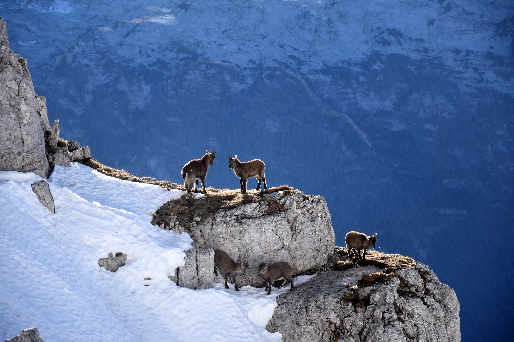

Stel dat men de hoeveelheid berggeiten wil schatten in een natuurgebied. Een methode die daarvoor gebruikt wordt heet **capture recapture**. Eerst worden $$t$$ dieren gevangen en gemarkeerd. Deze dieren worden nadien vrijgelaten en een eind later trekt men opnieuw op pad en vangt men $$n$$ dieren. Er zullen waarschijnlijk een aantal gemarkeerde dieren tussenzitten, men noemt men dit aantal $$s$$. 

Je kan nu het aantal dieren $$N$$ in het natuurgebied gaan schatten met behulp van onderstaande formule. Men gaat er immers vanuit dat de verhouding ongeveer bewaard blijft.

$$
    \dfrac{\color{BurntOrange}N}{t} = \dfrac{n}{s}
$$

{:data-caption="Enkele berggeiten" width="45%"}

## Opgave
Het onderstaande programma bevat een voorbeeld uit het Yellowstone National Park. Er werden een eerste keer 32 berggeiten gevangen, een maand later vangt men 75 berggeiten waarvan er 10 waren die een markering hadden.

Bepaal nu met bovenstaande formule (vorm deze eerst correct om) een schatting voor $$N$$. Sla deze op in de variabele `N`.

